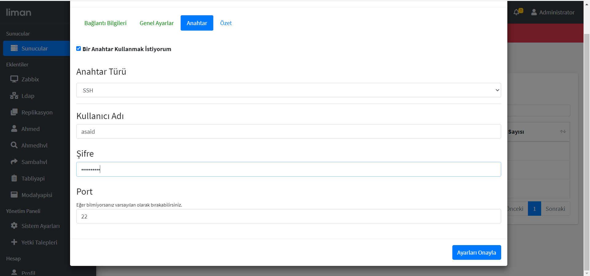
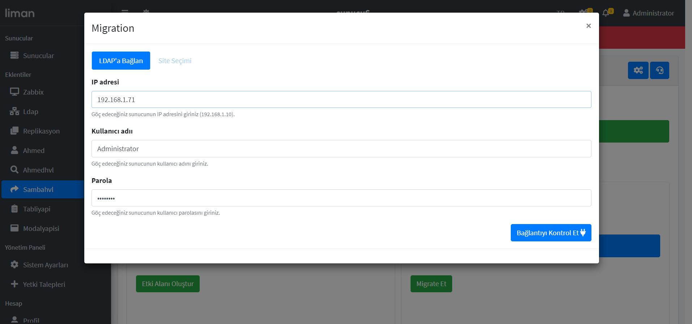
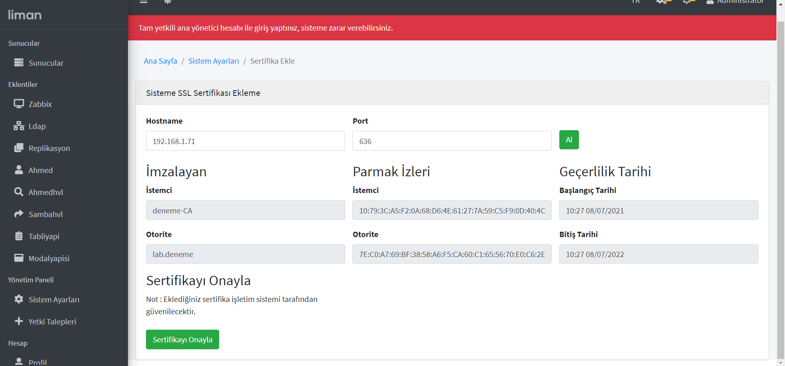

# Sanal Makine Kurulumu (Virtual Box)

1. Virtual Box uygulamasını bilgisayarınıza indirdikten sonra **youtube HAVELSAN TV** kanalında bulunan [pardus istemci kurulumu](https://youtu.be/0HgEGkXEqsc) videosundaki talimatları uygulayarak sanal makinenize pardus işletim sistemini kurabilirsiniz.

   

   

2. Sanal makinenize, pardus işletim sistemi kurulumunu tamamladıktan sonra; sanal makinenizin IP adresini statik hale getirmeniz gerekiyor.

   > Bu işlem için [linke](https://dev.to/aciklab/yeni-bir-samba-etki-alani-olusturma-42pd) tıklayarak **dev.to/aciklab** sitesinde bulunan ve **Ali Orhun Akkirman**'ın yazmış olduğu `Yeni bir SAMBA Etki Alanı oluşturma` adlı dokümandaki `Statik IP adresi tanımlama` bölümünü takip edebilirsiniz.

   

   

3. Sanal Makinenizin IP adresini statik hale getirdikten sonra **Oracle VM Virtual Box** arayüzünden sanal makinenizin Ağ ayarını değiştirmeniz gerekiyor.

   

   Sanal Makinenizin üzerine gelip **sağ tık** ile açılan menüdeki **Ayarlar** bölümüne tıklıyoruz.

   

   

   Açılan penceredeki **Ağ** kısmına tıklıyoruz.

   Buradaki **NAT** olarak seçilmiş olan ayarı **Köprü Bağdaştırıcısı** şeklinde değiştiriyoruz ve **TAMAM** butonuna basıyoruz.

   

4. Artık sunucunuzu liman'a eklemeye hazırsınız.

   

# Liman'a Sunucu Ekleme

1. Liman arayüzündeki **Sunucular** kısmına geliyoruz.

   

   

2. Burada bulunan **Sunucu Ekle** Butonuna basıyoruz.

   

   

3. Modaldaki tabların her biri için gerekli bilgileri tamamladığınızda sağ altta bulunan buton ile girdiğiniz bilgilerin doğruluğunu ve uyumluluğunu kontrol edebilirsiniz.

4. **Bağlantı Bilgileri** tabındaki **Sunucunuzun Adresi** kısmına sanal makinemize verdiğimiz statik IP adresini giriyoruz. **Sunucunuzun Portu** kısmına da **22** giriyoruz ve **Bağlantıyı Kontrol Et** butonuna basıyoruz. 

5. **Sunucuya başarıyla erişim sağlandı** uyarısını aldıktan sonra sıradaki tab ile devam edebiliriz.

   

   

6. **Genel Ayarlar** tabındaki **Sunucunuzun Adı** kısmına sunucuya vermek istediğimiz ismi giriyoruz.

7. **Şehir** kısmı için de bulunduğumuz şehri seçiyoruz.

8. **Sunucunuzun İşletim Sistemi** kısmını da doğru bir şekilde seçtikten sonra **Ayarları Onayla** butonuna basıyoruz.

9. **İsim Onaylandı** uyarısını aldıktan sonra sıradaki tab ile devam edebiliriz.

   

   

10. **Anahtar** tabındaki **Anahtar Türü** kısmı için SSH seçeneğini ile devam ediyoruz.

11. **Kullanıcı Adı** ve **Şifre** kısımları için sanal makinemizin kullanıcı adı ve şifresini giriyoruz. (sanal makineyi açtığımızda login olduğumuz bilgiler)

12. **Port** kısmı için **22** seçili olarak kalabilir.

13. **Anahtarı onayla** butonuna bastıktan sonra **Anahtarınız doğrulandı** uyarısını aldıktan sonra **Özet** tabına geçebiliriz.

    

    

14. **Özet** Tabında ekleyeceğimiz sunucu bilgilerini toplu halde görebiliyoruz.

15. Eğer herhangi bir sıkıntı yoksa **Sunucu Ekle** butonu ile sunucumuzu limana ekleyebiliriz.

    

    

16. Sunucumuzu limana eklediğimizde karşımıza aşağıdaki resimde de görüldüğü gibi bir ekran gelmeli. Bu ekranda sunucu yönetimi ile ilgili istediğimiz özelliklere ve bilgilere erişebiliriz.

    

    

17. Liman menüsünden **Sunucular**'ı seçtiğimizde, sunucumuzun tabloda listelendiğini görebiliriz.

    

    

# Sambahvl Eklentisinin Sunucuya Yüklenmesi

1. Sambahvl eklentisini bilgisayarımıza indirmemiz gerekiyor

   > Bu işlem için [linke](https://github.com/zekiahmetbayar/liman-sambahvl) tıklayarak **github**'da bulunan **liman-sambahvl** reposunu gidiyoruz. Ekranda gözüken yeşil **Code** butonuna bastığımızda açılan menüden **Download ZIP** ile **liman-sambahvl** reposunu bilgisayarımıza zip formatında indiriyoruz.

   

   

2. Liman arayüzündeki **Sistem Ayarları** kısmına geliyoruz.

   

   

3. **Eklentiler** tabını seçiyoruz ve **Yükle** butonuna basıyoruz.

   

   

4. Açılan **Eklenti Yükle** modal'ı için indirmiş olduğumuz zip dosyasını seçiyoruz.

   

   

   

5. Eklenti imzalanmamış uyarısı geldiğinde **Tamam** butonuna basıyoruz.

   

   

6. Böylece sambahvl eklentisini liman'a eklemiş olduk. **Sambahvl** eklentisini hem sol taraftaki menüdeki **Eklentiler** kısmında hem de **Sistem Ayarları** > **Eklentiler** kısmındaki tabloda görebiliriz.

   

   

7. **Sambahvl** eklentisini önceki adımda limana kurduğumuz sunucuya ekleyeceğiz. 

   Liman menüsünde yer alan **Sunucular**'a tıklayarak sunucu listesine erişiyoruz. 

   Buradan sambahvl eklentisini eklemek istediğimiz sunucunun üzerine gelip sol tık ile seçiyoruz.

   

   

8. Karşımıza gelen ekranda seçmiş olduğumuz sunucu bilgileri ve özellikleri bulunuyor. Buradan **Eklentiler** tabını seçiyoruz ve eklentiyi eklemek için **yeşil artı butonuna** tıklıyoruz.

   

   

9. Açılan modal'dan **Sambahvl** eklentisini seçip **Ekle** butonuna tıklıyoruz.

   

   

10. Böylece Sambahvl eklentisini sunucumuza eklemiş olduk. Liman arayüzünde bulunan menüdeki Sambahvl eklentisini seçersek karşımıza eklenti ayarları gelecek.

    

    

11. Bu eklenti ayarlarını belirlenen ölçütlere göre doldurduktan sonra karşımıza eklentinin **Kurulum** tabı çıkmalı.

    

    

    

# SambaHVL Paketini Kurma

1. Bu aşama için **Sambahvl** eklentimizdeki **Sambahvl Paketini Kur** butonuna tıklayarak süreci başlatıyoruz.

   

   

   

   

   

2. Kurulum tamamlandıktan sonra aşağıdaki gibi bir ekran karşımıza çıkmalı.

   

# Sambahvl Eklentisi Yardımıyla Etki Alanı Oluşturma

1. Samba paketi kurulumu sonrası karşımıza çıkan ekrandaki **Etki Alanı Oluştur** butonuna basarak süreci başlatıyoruz.

   

   

   

   

   

2. Kurulumu tamamladıktan sonra **Devam Et** butonuna basıyoruz ve karşımıza **Samba Bilgilerinin** olduğu ekran geliyor.

   

# İkinci Sunucunun Liman'a Eklenmesi ve Migrate İşleminin Yapılması

İkinci bir sunucuyu limana ekleyip samba eklentisinin hazır hale getirilmesi için;

1. **Sanal Makine Kurulumu (Virtual Box)**

2. **Liman'a Sunucu Ekleme**

3. **Sambahvl Eklentisinin Sunucuya Yüklenmesi (7. adımdan devam edebilirsiniz)**

4. **SambaHVL Paketini Kurma**

   aşamalarının tamamlanması gerekiyor.

**SambaHVL** paketinin kurulumu da tamamlandıktan sonra karşımıza çıkan ekrandan **Migration İşlemleri** altındaki **Migrate Et** butonuna basarak migration işlemini başlatmış oluyoruz.

Açılan penceredeki **IP adresi** kısmına migrate edilecek olan sunucunun IP adresini yazıyoruz.

**Kullanıcı adı** kısmına **Administrator**,

**Parola** kısmına da migrate edilecek olan etki alanının parolasını yazıyoruz ve **Bağlantıyı Kontrol Et** butonuna tıklıyoruz.

Sıradaki aşama olarak Etki alanımız içerisindeki **Site Seçimini** tamamlıyoruz ve migration işlemini başlatıyoruz.

Migration işlemi başladıktan sonra süreci takip etmek için ekrana yazılan log kayıtlarını inceleyebiliriz.

Migration işlemi bittikten sonra **Başarılı** uyarısını alıyorsak migration işlemini başarılı bir şekilde tamamlamışız demektir.

Sunucumuzu Etki alanına başarılı bir şekilde migrate etmiş olduk. 

Daha farklı konularda işlem yapmak veya bilgi almak için eklentide bulunan tabları inceleyebiliriz

## Migrate Hata Çözümü

1. Migrate işlemindeki bazı hataları sertifika ekleyerek çözebiliyoruz.

   Bunun için etki alanı oluşturduğumuz sunucu (sunucu5) için sertifika eklemeliyiz.

2. Liman arayüzünde bulunan **Sistem Ayarları** kısmına geliyoruz.

   

   

3. Sistem ayarlarına girdikten sonra **Sertifikalar** kısmına geliyoruz ve **Sertifika Ekle** butonuna tıklıyoruz.

   

   

4. Açılan ekrandaki **Hostname** kısmına sertifikayı eklemek istediğimiz sunucunun **IP adresini** giriyoruz.

   **Port** kısmına da **636** yazıp **Al** butonuna tıklıyoruz.

   Sertifika bilgileri geldikten sonra **Sertifikayı Onayla** butonuna basarak işlemi bitirebiliriz

   

   

   

5. Eğer migrate yapmak istediğiniz sunucu (sunucu6) için de sertifika eklemek istiyorsanız. Migrate işleminden sonra aynı adımları uygulayarak sertifika ekleyebilirsiniz.

